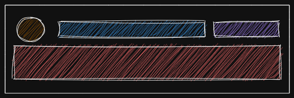

# Needl take home assessment

Welcome candidate. Thank you for taking your time to participate in the Needl take-home assessment for the internship as a Frontend developer.

Once you have completed the assessment, please reply to the email with the link to the `forked` GitHub repository.

This assessment aims to test you on the basics of web application development using React and your knowledge of HTML, CSS, and JavaScript.

## Prerequisites

- Node > 14.x
- GitHub account
- Basic knowledge of JavaScript and React

## Setup

1. You can skip this step if you have already set up Git on your local machine and already have a GitHub account

   - setup [`Git`](https://git-scm.com/downloads) on your local machine
   - create a new [GitHub account](https://github.com/)

1. Install Node > 14.x, or the LTS version ([installer](https://nodejs.org/en/download/))

1. [Fork](https://docs.github.com/en/pull-requests/collaborating-with-pull-requests/working-with-forks/about-forks) the GitHub [repository](https://github.com/girishk21/take-home-assessment)

1. Clone the forked repository to your local machine

1. Run `npm i` and `npm run dev`

1. Open the cloned folder in your preferred IDE

## Challenge

In this challenge, we'll be building a single-page feed app.

We will be provided with an API to load the posts. The API URL is `http://localhost:8080/api/posts`. The API accepts two query parameters, `page` and `num`. The `page` parameter will denote the current page the user is in, and the `num` parameter will represent the number of posts returned from the API. _**Both parameters are required.**_.

You can use [`useState`](https://reactjs.org/docs/hooks-state.html) hook to store the feed state and fetch the data using the [`fetch API`](https://developer.mozilla.org/en-US/docs/Web/API/Fetch_API/Using_Fetch).

You can follow this wireframe to implement the feed card.

The UI requirements are intentionally left open to your imagination and your creativity. Blow us away!

The app _must_:

1. Be implemented only using Functional components and hooks. Class-based components are not allowed

1. Have the ability to load posts as the user reaches the end of the page.

1. The posts should be loaded as a single list.

1. Should not send the fetch request after the end of the list is reached (to know if the user has reached the end of the list, check the response of the API)

1. Show a loading state when fetching the data

Bonus points:

1. Implement the state using [`useReducer`](https://reactjs.org/docs/hooks-reference.html#usereducer) instead of multiple `useState`

1. Automatically fetch the next page when the user is about to reach the end of the page

1. Implement the app in TypeScript

1. If you're done with all the requirements and the bonus tasks, in a new branch, try and implement the fetch logic using [`react-query`](https://react-query-v3.tanstack.com/)

Have fun working on this challenge! See you on the other side!

## Links and Resources

- [Git](https://git-scm.com/downloads)
- [GitHub](https://github.com/)
- [Node.js](https://nodejs.org/en/)
- [React](https://reactjs.org/)
- [Fetch API](https://developer.mozilla.org/en-US/docs/Web/API/Fetch_API)
- [Using Fetch API](https://developer.mozilla.org/en-US/docs/Web/API/Fetch_API/Using_Fetch)
- [URLSearchParams](https://developer.mozilla.org/en-US/docs/Web/API/URLSearchParams)
- [React + Fetch](https://reactjs.org/docs/faq-ajax.html#example-using-ajax-results-to-set-local-state)
- [React Query](https://react-query-v3.tanstack.com/)
